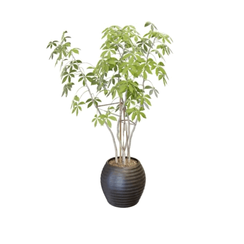

# GENIE: Gaussian Encoding for Neural Radiance Fields Interactive Editing

<p align="center">
  <a href="https://arxiv.org/abs/2508.02831"></a>
  <a href="https://huggingface.co/datasets/MikolajZ/genie_demo_data"></a>
  <a href="https://huggingface.co/datasets/MikolajZ/genie_data"></a>
  <a href="https://mikolajzielinski.github.io/genie.github.io/"></a>
</p>

👋 Hi there!  
If you’ve landed here looking to **edit NeRFs** (Neural Radiance Fields) you’re in the right place. This project lets you 🛠️ interactively modify NeRF scenes with ease.  
Feel free to explore 🔍, clone the repo 📦, and start experimenting 🚀. Contributions, issues, and ideas are always welcome! 💡✨

<p align="center">
  
</p>

<p align="center">
  
  
  
  
</p>

# ⚙️ Installation
### Docker (preferred way)
The easiest way to run our model is using the Docker container.
First, install [OptiX SDK 8.1.0](https://developer.nvidia.com/designworks/optix/downloads/legacy) in `genie/knn` directory. 
Then simply run the command below, and everything will be set up for you automatically.
``` bash
# Build, run and enter the container
./docker/docker_run.sh
```

### Manual installation
This project is developed as an extension for Nerfstudio. To get started, please install [Nerfstudio](https://github.com/nerfstudio-project/nerfstudio/tree/2adcc380c6c846fe032b1fe55ad2c960e170a215) along with its dependencies. <br>

<p align="center">
    <!-- pypi-strip -->
    <picture>
    <source media="(prefers-color-scheme: dark)" srcset="https://docs.nerf.studio/_images/logo-dark.png">
    <source media="(prefers-color-scheme: light)" srcset="https://docs.nerf.studio/_images/logo.png">
    <!-- /pypi-strip -->
    
    <!-- pypi-strip -->
    </picture>
    <!-- /pypi-strip -->
</p>


Install [OptiX SDK 8.1.0](https://developer.nvidia.com/designworks/optix/downloads/legacy) in `genie/knn` directory.
Then build the CUDA code by running:
``` bash
./build_optix.sh
```
> ⚠️ If the build fails, please double-check that the paths to the OptiX SDK and CUDA include directories are correct in build_optix.sh.
We have tested with OptiX 7.6 and 8.1.0. OptiX 9.0 is not supported at the moment.

Finally, install this repo with:
``` bash
pip install -e .
ns-install-cli
```
🚀 This will install the package in editable mode and kick off the Nerfstudio CLI installer to get you all set up and ready to go! 🎉

### Optional Installation
If you want to experiment 🧪 with different KNN algorithms you can install [Faiss](https://github.com/facebookresearch/faiss/tree/main). We found GPU acceleration wasn’t working out-of-the-box, so we had to compile Faiss from source with Python bindings for it to work properly. <br>

Also, uncomment the Faiss import and two KNN classes in `genie/knn/knn_algorithms.py` to enable it. Then in `genie_config.py` you can specify different KNN.

# Running the demo
To test if everything was installed properly, you can run the `ficus` demo.
First download the demo dataset.

```bash
git lfs install
git clone https://huggingface.co/datasets/MikolajZ/genie_demo_data
```

Place the `data` and `blender` folder into `genie`.

```bash
# First train the model with
ns-train genie --data data/ficus --timestamp genie_demo

# Prepare the animation with blender
blender -b blender/ficus/Ficus.blend -P blender/ficus/script.py

# Downscale and reformat animation
genie-export ply-from-obj --batch-folder blender/ficus/plys --gausses-per-face 1 --output-folder outputs/ficus/genie/genie_demo/reference_meshes --ply-mode True

# Export triangle soup
genie-export triangles --load-config outputs/ficus/genie/genie_demo/config.yml

# Bind triangle soup with animation and get final edits
genie-export ply-from-edits --load-config outputs/ficus/genie/genie_demo/config.yml

# Now you can render the animation
genie-render dataset --load-config outputs/ficus/genie/genie_demo/config.yml --rendered-output-names rgb --output-path edits/genie_demo --selected-camera-idx 50

# Render the video
ffmpeg -framerate 24 -i %05d.jpg -c:v libx264 -pix_fmt yuv420p ficus_wind.mp4
```

# Data preparation
### Synthetic data
By default, our method supports the NeRF Synthetic format. If you want to use your own data you need to put `sparse_pc.ply` in the dataset folder. For synthetic data we used [LagHash](https://github.com/theialab/lagrangian_hashes) to generate the initial point cloud but COLMAP sparse point cloud works just as fine if you don't want to train another model.

### Real data
For real data please follow [Nerfstudio data format](https://docs.nerf.studio/quickstart/data_conventions.html). Like with synthetic data, you'll also need to place `sparse_pc.ply` in the dataset folder to initialize the network with a sparse point cloud.

### Replicating results from the paper
If you want to replicate the results that we showed in the paper you can download all our datasets with:
```bash
git lfs install
git clone https://huggingface.co/datasets/MikolajZ/genie_data
```
You will also find there all the config files we have used for training so you can use the same hyperparameters as we did. In [dataset `README.md`](https://huggingface.co/datasets/MikolajZ/genie_data) you will find the description of the dataset content and tips for training the models.

# Training the network

Example train commands:
``` bash
# For nerf synthetic
ns-train genie --data <path_to_dataset>

# For MiP-NeRF but also other real data
ns-train genie --data <path_to_dataset> \
  --pipeline.model.near-plane 0.0 \
  --pipeline.model.far-plane 1000 \
  --pipeline.model.background-color random \
  --pipeline.model.disable-scene-contraction False \
  --pipeline.model.cone-angle 0.00390625 \
  nerfstudio-data \
  --load-3D-points True \
  --downscale-factor 4
```

# Rendering results
We use [Blender](https://www.blender.org) for generating our animations. It is important to generate for each frame of your animation an `*.ply` file containing modified Gaussians obtained from the training. You can find them in the output folder of your training under the name `step-<num_steps>_means.ply`. 

> ⚠️  It is very important to use only `*.ply` files since they don't change the order of vertices upon the save.

In the output folder of your trained model (usually named with the timestamp) create `camera_path` folder and put your `*.ply` file there. It is important to name them `00000.ply`, `00001.ply`, `00002.ply`, etc.

Now you are ready to go and you can start rednering. You have two options right here:
### Dataset Render
``` bash
genie-render dataset \
  --load-config outputs/<path_to_your_config.yml> \
  --output-path edits/<output_folder> \
  --rendered-output-names rgb \
  --selected-camera-idx <num_camera_from_test_data>
```
 - If you specify a camera index, all frames will be rendered from that viewpoint.
 - If not, the tool renders from all test-time cameras.

### Camera Path Render
``` bash
genie-render camera-path \
  --load-config outputs/<path_to_your_config.yml> \
  --camera-path-filename <camera_paths_folder> \
  --output-path edits/<output_folder> \
  --output-format images
```
-  The camera path here refers to what’s generated by the Nerfstudio viewer not your `*.ply` animation folder!

# Driving Gausses with a mesh
First thing that you need to do is to export the traingle soup from the model. We got you right there and we have prepared this command:
``` bash
genie-export triangles --load-config outputs/<path_to_your_config.yml>
```
This will create a traingle soup in the project output folder. In this output folder create another folder called `reference_meshes` put the edits of your Gausses in this folder in the same format as for rendering. Now this is important. Make sure that `triangle_soup.ply` and `00000.ply` represent your model in the exact same state (no modifications) since we will use those two as a reference. Other `*.ply` files can be in any configuration.

Now run the script:
``` bash
genie-export ply-from-edits --load-config outputs/<path_to_your_config.yml>
```
This will drive the Gausses and will create `camera_path` folder. Now you can proceed to normal rendering mentioned above.
